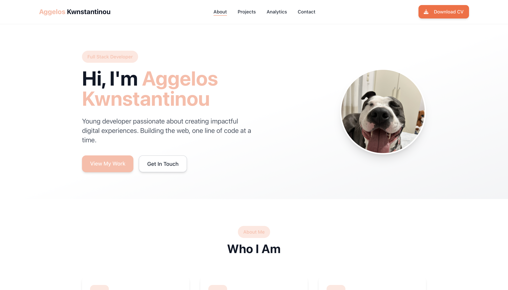

# Aggelos Kwnstantinou – Portfolio Website



Welcome to the official portfolio of **Aggelos Kwnstantinou**, a 17-year-old full-stack developer from Greece. This website showcases my projects, skills, and background, and includes a downloadable CV and contact information.

🌐 **Live Site:** [https://aggeloskwn.com](https://aggeloskwn.com)

---

## 🚀 Tech Stack

- **Frontend**: React.js, Tailwind CSS, TypeScript
- **Backend**: Node.js, Express.js, Stripe, Drizzle ORM, Nodemailer
- **Deployment**: Replit + Custom Domain (Hostinger DNS)

---

## 📦 Setup & Installation

### 1. Clone the repository
```bash
git clone https://github.com/aggeloskwn7/portfolio.git
cd portfolio
```

### 2. Install dependencies
```bash
npm install
```

### 3. Start the development server
```bash
npm run dev
# or if using create-react-app
npm start
```

Your site will run at `http://localhost:3000` by default.

---

## 🧰 Features

- Personal intro and background
- CV Download button
- Project showcase (RageBet Casino, Weather App)
- Contact section
- Fully responsive and mobile-friendly
- Deployed on Replit with custom domain

---

## 📄 License

This project is open source and available under the [MIT License](./LICENSE).

---

## 💬 Connect with Me

- GitHub: [@aggeloskwn7](https://github.com/aggeloskwn7)
- Portfolio: [https://aggeloskwn.com](https://aggeloskwn.com)
- Email: [k1ngsx@icloud.com](mailto:k1ngsx@icloud.com)

---

> Built with ❤️ by Aggelos Kwnstantinou